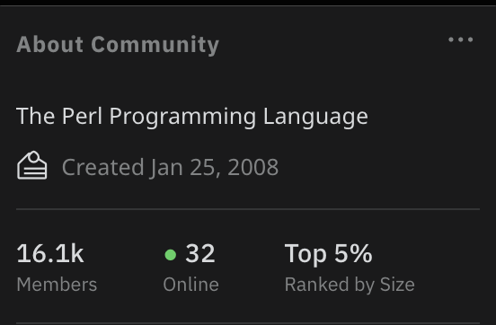
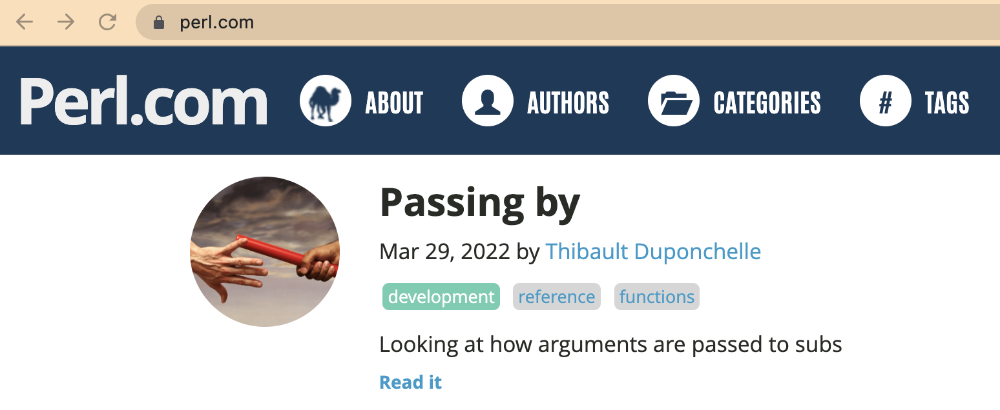
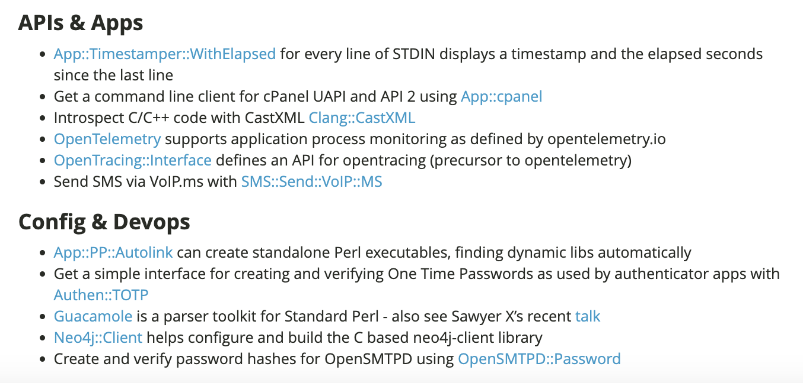

# Whither Perl?

Olaf Alders
Toronto, July 2023

olaf@wundersolutions.com
https://fosstodon.org/@oalders
https://github.com/oalders
https://metacpan.org/author/OALDERS

---

# The state of the Onion

* Is Onion even the right word?
* What's currently going on in the world of Perl?
* What got us here?
* What can we do to keep things moving?

---

# The History (or some version of it)

* Perl was once an obvious choice for lots of applications, including web development
* Over time more choices became available. Why?
  * mod_perl was non-trivial to configure and run
  * CGI had its own challenges
  * PHP (for example) made it easy to develop for the web
    * Web designers who needed a dynamic component now had an easier way of doing things
    * Some portion of the Internet went from writing messy Perl to writing messy PHP

---

# The legacy of Matt's Script Archive

http://www.scriptarchive.com/

* This was the introduction to Perl for many people
* There has been great debate and wringing of hands over this
* It didn't encourage best practices, but it encouraged a lot of people to deploy Perl scripts

---

# The only thing worse than being talked about is not being talked about.

Oscar Wilde

---

# You should learn Perl

* When I was in university, I wanted to mess around with building a web site. I was told "You should learn Perl".
* I did
* Here I am

It's the flexibility of Perl and the prevalence of messy CGI scripts that brought a lot of us into the Perl universe. 

There is no point in getting worked up over a lot of new people joining the party.

---

# Choice is a good thing

* PHP, Ruby, Python etc also became viable choices for web development
* Having more options is good
* But, at some point, Perl came to be regarded as 
  * not modern
  * read only
  * dead

---

# Can a language die?

* Life and death are essentially binary states
* Is this a helpful designation for a language?
* Is Latin dead?
  * It lives on in various forms via terminology and has a continuing presence in and influence on other natural languages

---

# Is Perl dead?

* This has been coming up for years and it prompts lively debate, but are we even asking the right question?
* Maybe we should be asking, "Is Perl a viable choice for doing X"?
  * That's a much easier question to answer and it can help avoid some of the subjective bias people bring to the "dead language" argument.

---

# What does your application really need?

* Static type checks
* Speed
* High performance in a resource-starved environment?
* Expressive syntax
* To be prototyped quickly
* To leverage the power of CPAN

Depending on your answers to the above, Perl may or may not be the right choice for what you want to do. It's suitabilty for a certain task doesn't make it either alive or dead. 

---

# Protoyping vs Scaling

* Sometimes the language you prototype with is not the language you scale with
  * Other languages may be 
    * more performant
    * easier to hire and train for
  * Maybe you just hired a bunch of new developers or managers with an irrational dislike of Perl

---

# The Perl to [Java|Go|whatever] rewrite

* The lasting impact is that over time, we lose financial backing
* When corporations feel like they no longer need a robust Perl ecosystem, they send their dollars somewhere else
* We need some level of funding in order to keep forging ahead

---

# Fundraising is harder

* I have been doing some fundraising for MetaCPAN and I did a little bit for this conference
* Some companies which still make millions on their Perl codebase are no longer willing to give back 
* Other companies have stepped up, so it's not all doom and gloom

---

# The Problem

* Perl has clearly lost a lot of market share over the last 10 (or more) years
* This pattern can clearly be seen by PAUSE activity
  * PAUSE activity essentially peaks in 2012 and starts to drop off in 2013
  * See http://neilb.org/2022/02/07/cpan-report-2022.html
* 10 years on, there are no signs that the trend is changing  

---

# YAPC::NA Toronto (2005)

* PAUSE was now at least 10 years old
  * https://pause.perl.org/pause/query?ACTION=pause_06history
* There had already been 5 editions of the Perl Advent Calendar
* Perl 5.8.1 had been released 2 years earlier (Sept 2003)
* It would be another 2 years until the release of 5.10.0 (Dec 2007)

---

# New Perl books were being published

* Dave Rolsky was at the conference, talking about Mason
  * "Embedding Perl in HTML with Mason", a 318 page book by Ken Williams abd Dave Rolsky had been released by O'Reilly in October 2002 (about 2.5 years prior)
* "Perl Testing: A Developer's Notebook" by Ian Langworth and Chromatic was just days from publication (July 2005)

---

# Where are we today?

## Books

I don't think I've seen a Perl book in a local bookstore in many years. 
* Perl books still do occasionally get published
  * Apress released "Advanced Perl Programming: From Advanced to Expert" in May 2020
  * O'Reilly released Learning Perl, 8th edition in August 2021
* There is some self publishing
  * brian d foy published an updated version of "Mojolicious Web Clients" in June 2023
  * Dave Cross last updated "GitHub Actions Essentials" in April 2023

---
  
# Current status: 

What is our current status? 

* I don't feel like I can call it a "state of the onion/camel/velociraptor"

--- 
# CPAN

[Insert slides from neilb]

* Declining activity on CPAN

---

# Conferences: North America

* North American Conferences are still running annually, after going through various name changes
  * We even moved to the cloud during Covid lockdown

---

# Conferences: Asia and Japan

* The last YAPC::Asia was apparently held in 2015
  * There was YAPC::Japan::Online in 2022 ❤️
  * There was a YAPC::Kyoto in March of 2023 ❤️

https://www.youtube.com/@jpa_perl

---

# Conferences: European Union

* YAPC::EU appears to be dormant
* The Perl and Koha conference will be in Finland in August 2023 ❤️

---

# PerlMongers / pm.org

* Local PM groups appear to be disappearing
* The calendar of upcoming events is empty
* Every monger group in Canada links to a site which is either oudated or missing
  * This includes Toronto.pm. I guess our hosting disappeared and we didn't notice.
    * https://github.com/perlorg/www.pm.org/pull/182
  * I suspect some PM group sites have been replaced via meetup.com pages

---
# Reddit: /r/perl

* Saturday evening, but anecdotally feels like more than the typical amount of users

---

# perl.com 

---

# perl.com

* Last article was published more than 1 year ago
  * Mar 29, 2022
* At this point, the site appears to have no clear ownership or direction
* perl.com doesn't actually belong to TPRF. It appears to be on loan.
* The site is powered by Hugo (a modern static site generator). It would be easy to revive, if there's the will to do this.

---

# perl.com: "What's New on CPAN" Articles

* Last published June 2020

---

# Can We Revive This?

These articles solved a discoverability problem and likely encouraged more adoption of new modules.

* Hire someone to write this article monthly (USD 200?) 
* Hire someone to edit this article monthly (USD 50?)
* Allow sponsor logos on the site to cover the writing and editing costs
  * This advertising model already works on metacpan.org
  * Monthly cost ~USD 250

---

# Why Hire?

* Buying a service allows you to make demands to follow a schedule
* It's one way to give back to open source developers
* Logos give increased exposure to companies which remain supportive of Perl
  * Especially those who may be having trouble hiring

---

# learn.perl.org

* This could be a good starting point for people new to Perl
  * No obvious mention of modern web frameworks
* https://learn.perl.org/books/
  * No books after October 2016
  * Learning Perl, 8th edition was published in August 2021

---

# perladvent.org

* First publication in Dec 2000
* Has published every year since then
* 2021 hit a bump in the road, with no articles beyond Dec 1
* In 2022 the calendar roared back to life with 27 articles
* The 2023 Call for Papers is now open
  * https://cfp.perladvent.org/
  * If you're interested in writing an article or editing articles (or both), please open an issue at https://github.com/perladvent/Perl-Advent/

---

# Low Bus Numbers

Some key parts of the Perl ecosystem are effectively being run by one or two people. What happens if the are no longer able to contribute?

---

# CPAN Testers

* Doug Bell took this project over from Barbie.
* We have tried to get more volunteers to help Doug, but with no lasting success

---

# Devel::Cover / cpancover.com

* Paul Johnson
* If you use Coveralls or codecov.io, you probably use Devel::Cover

---

# PPI

* Christian Walde (mithaldu)
* I help a bit where I can, but this module is quite complex, many tools rely on it and it could use some help

---

# CPAN Security Advisory Database 

There has been recent activity around identifying modules with existing CVEs. https://github.com/briandfoy/cpan-security-advisory

* Hopefully this information will be integrated with the front end of MetaCPAN

---

# CPAN Security Working Group

* Established at the Perl Toolchain Summit in April 2023
* https://security.metacpan.org/

See also https://github.com/briandfoy/cpan-security-advisory

---

# Recent Releases

* Mozilla::CA now runs a nightly build which creates a pull request if the module needs to be updated
* I just released a new LWP::Protocol::https which fixes a years-old CVE

---

# prepan.org

* A place to discuss CPAN modules before your first upload
* Domain registration expired
* The repositories still exist in the MetaCPAN GitHub org
  * I have no idea where the data is
  * Nobody has expressed any desire to get this service back online

---

# Protecting Your Domain Names

* Transfer ownership of your Perl-related domain to TPRC
* Domains will auto-renew at no cost to you
* The registration expiration failure mode is eliminated

---

# How to Transfer Your Domain Name

* Ask on TPRF Slack
* Or just get in touch with me. My contact info is at https://metacpan.org/author/OALDERS

---

# Some Key Problems

* It looks like there's a lack of clear ownership for various community resources
  * perl.com has no editor
  * learn.perl.org does not appear to have an editor
* Branding, anyone?

---

# The Official Perl Logo Quiz

A) camel
B) onion
C) velociraptor
D) all of the above
E) none of the above

---

# The Official Logo Solution

* Convince O'Reilly to clearly assign rights to use a camel as a Perl logo
* Design a new logo, with buy-in from Perl communities
  * This would require identifying the various stakeholders so that we can establish who would make this decision

# Can We Do More with Less?

* Figure out which resources are worth saving and which could be archived
* Move more code and site ownership into GitHub organizations
* Switch to static site generators which can auto-deploy to GitHub pages (Jekyll/Hugo) rather than requiring people to jump through hoops to locally deploy and edit source code

---

# Myth: There are no new Perl developers

* New Perl developers are being created constantly
  * They inherit legacy code which they have with they have to:
    * maintain
    * extend
    * rewrite
    * all of the above

---

# Are we giving new (and current) Perl developers great development tools?

* Focus on the editor experience
* Make the setup and execution of editing Perl on VSCode simple and easy
  * Try out Perl Navigator: https://marketplace.visualstudio.com/items?itemName=bscan.perlnavigator
  * Send pull requests (bscan is very responsive)
  * Let's focus efforts on one solution and make it even better
  * `vim` users can use Perl Navigator as a Language Server
  * Let's debug this in as many editors as possible

---

# Formatting

* We've got formatting solved. `Perl::Tidy` is an incredible tool and the developer is very responsive
* Best of all, we have one "go to" tool for tidying. No TIMTOWDI to work your way through

---

# Linting

* `Perl::Critic` as linting down to a science, but there are a lot of rules. `Perl Navigator` has a default critic profile: https://github.com/bscan/PerlNavigator/blob/main/server/src/perl/defaultCriticProfile
* This might be a good place to standardize on enforcing simple, understandable best practices for beginners 

---

# Fixing

* We can leverage `PPI` and `Perl::Critic` to fix some classes of linting errors
  * See https://metacpan.org/dist/App-PerlNitpick
* Use https://metacpan.org/dist/App-perlimports where possible
  * This is an example of automated rewriting of your code
  * https://www.youtube.com/watch?v=fKqxdTbGxYY (Last year's conference talk)

---

# Happy Developers = Happy Managers

* Making Perl a pleasant and easier language to work with can drive developer adoption (or retention)
* The more that Perl remains as a production languge, the better our chance of corporate donations

---

# Donations Matter -- a lot

* Without donations, a lot of things we care about are in danger
  * grants
  * conferences (YAPF, Perl Toolchain Summit, etc)
  * infrastructure for hosting etc.
    * some of these things (but not all) exist as in-kind donations
    * donated equipment and services can disappear
      * new management
      * new ownership
      * shifting priorities
    * sometimes donated services disappear with very little notice

---

# Things That Are Helpful to Know

* https://perl.theplanetarium.org/
  * Has an RSS feed
  * Aggregates various Perl news sources
  * Improves upon http://ironman.enlightenedperl.org/ and https://blogs.perl.org/ 

---

# Helpful (continued)

CPAN authors, add yourself to the CPAN dashboard
* https://cpandashboard.com/
  * Quick overview of Kwalitee scores, build status and test coverage

---

# Helpful (Continuous Integration)

If you need Docker images with a pre-installed Perl and pre-installed test and development modules, have a look at https://github.com/Perl/docker-perl-tester

---

# Is Anyone in Charge?

* There is no dictator, benevolant or otherwise
* We're kind of bumbling along, sometimes in the same direction
* Who are some of the stakeholders?

---

# Stakeholders

  * TPRF
    * Fundraising
    * Grants
    * Marketing
    * Communication
  * PSC & P5P
    * Decisions about Perl the language
  * The Perl Toolchain
    * Decisions about PAUSE, CPAN, testing and quality assurance modules
  * MetaCPAN
    * Part of the toolchain, but exists as a distinct organization
    * Has its own fundraising and infrastructure independent of other parts of the Perl ecosystem

---

# Project Stakeholders

There are some very active projects whose voices should probably be heard when important decisions are made

* Mojolicious
* Catalyst
* Dancer
* DBIx::Class
* Perl Weekly
* Authors of Perl books

---

# A meeting of the stakeholders?

* Perhaps representatives from some or all of these groups could meet quarterly for 90 minutes to discuss how they can help each other move forward?
* If we need to consider a new logo, getting buy-in from across the Perl communties is key. 
* As I understand it, TPRF does consider themselves to have the mandate for a new logo and I think that's a correct assumption.

---

# TPRC Community Representatives

On a related note, TPRC does have an open door for people around the Perl world to make themselves heard.

* Meetings are on Friday per month at 17:30 UTC