# Whither Perl? 🧭

Olaf Alders

Toronto, July 2023

https://fosstodon.org/@oalders
https://github.com/oalders
https://metacpan.org/author/OALDERS
olaf@wundersolutions.com

Note:

* Thank the organizers and volunteers
* What's currently going on in the world of Perl?
* What got us here?
* What can we do to keep things moving?

---

## The History 📚 
### (or some version of it)

Note:
* It's safe to say that Perl's market share has long been in decline
* Perl was once an obvious choice for lots of applications, including web development
* Over time more choices became available

---

## There's no going back ◀️

Note:
* We can't restore Perl to its former glory
* It was in the right place at the right time
* There are now far too many good options now
* That doesn't mean that Perl is finished as a Language

---

## Is Perl dead? 🪦

Note:
* Life and death are essentially binary states

---

## Can a language really die? ⚰️

Note:
* Is this even a helpful bucket to put a language in?
* Is Latin dead?
  * It lives on in various forms via terminology and has a continuing presence in and influence on other natural languages
* On the other hand, perhaps it's helpful to think of a language in terms of a lifecycle

---

## Is Language X dead? 👻

Note:
* This has been coming up for years and it prompts lively debate, but are we even asking the right question?
* Maybe we should be asking, "Is language X a viable choice for doing Y"?
  * That's a much easier question to answer and it can help avoid some of the subjective bias people bring to the "dead language" argument.

---

## Protoyping vs Scaling ⚖️

* Sometimes the language you prototype with is not the language you scale with

Note:
  * Other languages may be
    * more performant
    * easier to hire and train for
  * Maybe you just hired a bunch of new developers or managers with an irrational dislike of Perl

---

## The Perl to [Java|Go|whatever] rewrite ☕

Note:
* The lasting impact is that over time, we lose financial backing
* When corporations feel like they no longer need a robust Perl ecosystem, they send their dollars somewhere else
* We need some level of funding in order to keep forging ahead

---

## Donations Matter -- a lot 💳

* grants
* conferences (TPRC, Perl Toolchain Summit, etc)
* infrastructure for hosting etc.

Note:
Without donations, a lot of things we care about are in danger
---

## Money is Better Than In-Kind Donations 💶

* donated equipment and services can disappear
  * new management
  * new ownership
  * shifting priorities
* sometimes donated services disappear with very little notice

Note:
The first donated MetaCPAN servers went offline with only 60 days notice.
Luckily EPO helped us get a new sponsorship with Bytemark, which we've
continued for many years since then.

---

## Language Activity Indicators 📊

Note:
* Let's take a look at several different indicators to get an idea of where we might be at

---

## CPAN Activity is on a downward trajectory

See http://neilb.org/2022/02/07/cpan-report-2022.html

* All of the following charts have been created by Neil Bowers. 
* Some specifically for this talk.

Note:
* Perl has clearly lost a lot of market share over the last 10 (or more) years
* This pattern can clearly be seen by PAUSE activity
  * PAUSE activity essentially peaks in 2012 and starts to drop off in 2013
* 10 years on, there are no signs that the trend is changing

---

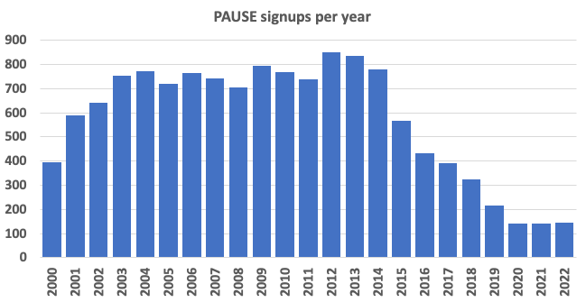

---

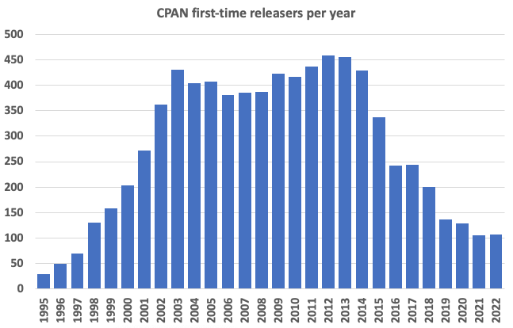

---

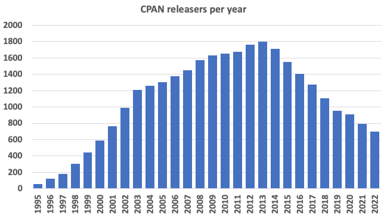

---

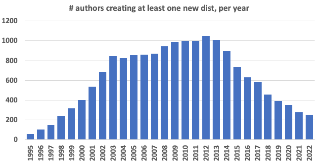

---

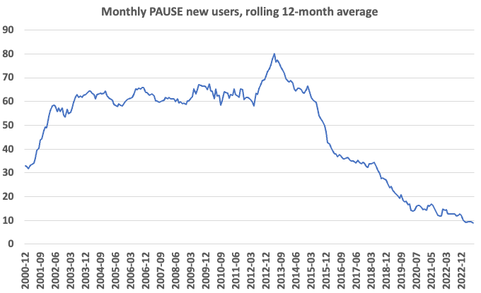

---

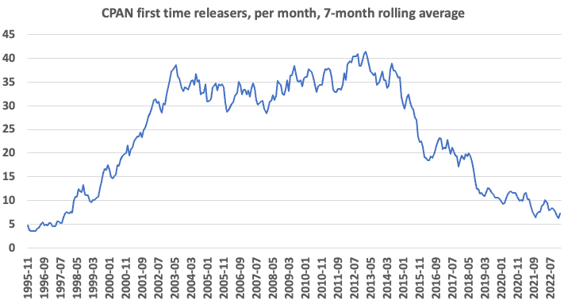

---

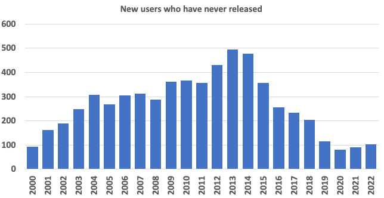

---

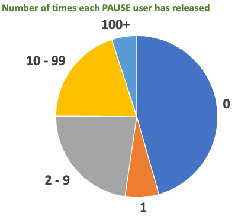

---

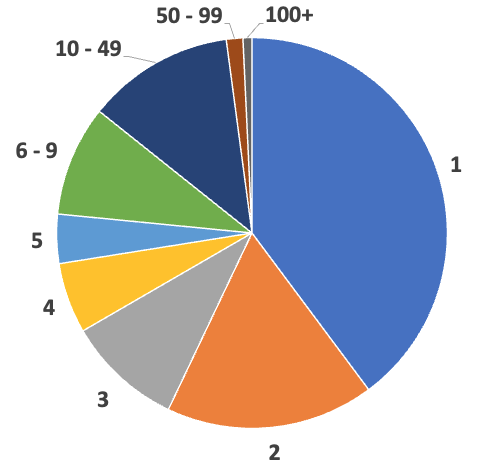

Note:
his is how many different distributions have PAUSE users released.
Excludes people who have never released

---

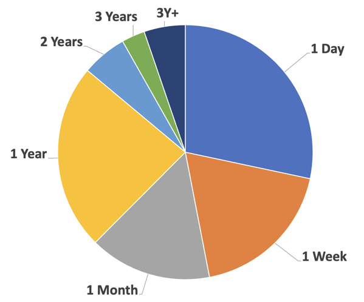

Note:
For people who do at least one release, how long was it between them signing up
and doing their first release?

The "1 Week" means "within the first week, but not on the first day", and so
on. Everyone who’s going to release does it within a year of getting their
account, but a good chunk wait more than a month.

But nearly half of them release within a week, so we can assume that they’re
signing up because they’ve got something to release (or they’re reading
Intermediate Perl and releasing a dummy/test distribution.

Some of the people in the 3Y+ pot should really be in a much earlier pot, but
they released "malformed" things, and I’m not gonna worry about them. Some
people got a PAUSE account for reasons other than releasing, but eventually got
around to releasing.

---

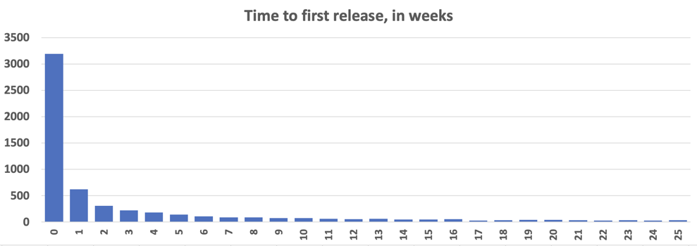

Note:
The first two slices of the pie are "week 0", then week 1, 2, and 3 are making
up "1 Month" in the pie chart. The histogram has a very long tail, which gets
rolled up in the pie chart. I’m just showing the first half year here, so show
how quickly it drops off.

When people sign up for PAUSE they get an email with a bunch of useful
information. I’ve thought we should give more concrete stuff in that email, but
a lot of people are unlikely to have that email still lying around when they
finally get around to their first release.

---

## Lifetime releases per author

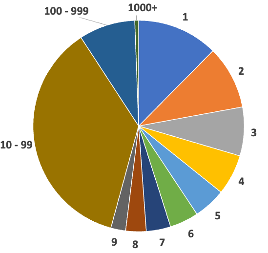

Note:
So a quarter of people only ever do 3 releases; half do 7 or fewer releases

---

### Author Retirement Plans 🏖️

* What will happen to CPAN activity when authors no longer need these tools to
  make a living?

---

## CPAN Day: Aug 16th

The anniversary of the first ever CPAN upload: Aug 16, 1995

Note:
If you haven't released anything to CPAN this year, how about fixing a bug?
---

## So much friction 🪚

* Researching how to create a new CPAN distribution can leave you paralyzed by choice

Note:
* Other languages don't put up the same barriers or offer so much choice from the outset
* The Rust toolchain is a great example
* Publishing a go module is not much more than pushing your code to GitHub

---

## So much choice 🛠️ 

Creating a new CPAN distribution? Just use:

* Dist::Zilla
* Dist::Milla
* Minilla
* Module::Build
* Module::Build::Tiny
* ExtUtils::MakeMaker
* Zilla::Dist

Note:
We already have excellent, powerful authoring tools. Can we create a wrapper
around these which will do everything which a casual user can leverage to
upload a distribution to CPAN?

---

## So much choice ⛏️

Installing from CPAN? Just use:

* cpan
* cpanplus
* cpanminus
* cpm

---

## PAUSE vs CPAN vs MetaCPAN 🐾

Are these distinctions important to a casual user? 

Note:
A lot of people don't know the practical differences between these moving parts.
Either try to unify them more (in interface) or present them in a way that
casual users don't need to care

---

## What About Books? 📖

---

### Traditional Book Publishers

* "Advanced Perl Programming: From Advanced to Expert", Apress, May 2020
* Learning Perl, 8th edition, O'Reilly, August 2021

Note:
* Perl books still do occasionally get published
---

### Self Publishers

* "Mojolicious Web Clients", brian d foy, updated June 2023
* "GitHub Actions Essentials", Dave Cross, updated April 2023

Note:
I don't think I've seen a Perl book in a local bookstore in many years.

---

## What About Conferences? 🎤 

---

## Conferences: North America

* You're at one right now ❤️
* There will be another next year ❤️

Note:
* North American Conferences are still running annually, after going through various name changes
  * We even moved to the cloud during Covid lockdown

---

## Conferences: Asia and Japan

* The last YAPC::Asia was apparently held in 2015, BUT...
  * There was YAPC::Japan::Online in 2022 ❤️
  * There was a YAPC::Kyoto in March of 2023 ❤️

https://www.youtube.com/@jpa_perl

---

## Conferences: European Union

* YAPC::EU appears to be dormant
* The Perl and Koha conference will be in Finland in August 2023 ❤️

---

## PerlMongers / pm.org

https://github.com/perlorg/www.pm.org/pull/182

Note:
* Local PM groups appear to be disappearing, but pm.org can be deceptive
* The calendar of upcoming events is empty
* Every monger group in Canada links to a site which is either oudated or missing
  * This includes Toronto.pm. I guess our hosting disappeared and we didn't notice.
  * I suspect some PM group sites have been replaced via meetup.com pages

---
## Reddit: /r/perl

Note:
* Saturday evening, but anecdotally feels like more than the typical amount of users

---

## perl.com

Note:
* Last article was published more than 1 year ago
  * Mar 29, 2022
* The site is powered by Hugo (a modern static site generator). It would be
  easy to revive, if there's the will to do this.
* At this point, the site appears to have no clear ownership or direction

---

### perl.com:

### "What's New on CPAN" Articles

* Last published June 2020

Note:
* These articles solved a discoverability problem and likely encouraged more
adoption of new modules.
* Note that the last month of publication is the month that Sawyer announced Perl 7

---

## Can We Revive This?

🤑 🤑 🤑

Note:
* Hire someone
  * to write this article monthly
  * to edit this article monthly
* Allow sponsor logos on the site to cover the writing and editing costs
  * This advertising model already works on metacpan.org

---

## Why Hire?

Note:
* Buying a service allows you to make demands to follow a schedule
* It's one way to give back to open source developers
* Logos give increased exposure to companies which remain supportive of Perl
  * Especially those who may be having trouble hiring

---

## perl.com: A springboard for all things perl?

Note:
Organize the content in a way that a beginner could come to perl.com and find
what they need to begin contributing.

---

## learn.perl.org

* https://learn.perl.org/books/
  * No books after October 2016
  * Learning Perl, 8th edition was published in August 2021 🤔

Note:
* This could be a good starting point for people new to Perl
  * No obvious mention of modern web frameworks
* This could probably be merged into perl.com

---

## perladvent.org 🎅

* First publication in Dec 2000

---

## perladvent.org 🤶

* Has published every year since 2000

---

## perladvent.org 🧝

* 2021 hit a bump in the road, with no articles beyond Dec 1

---

## perladvent.org 🎁

* In 2022 the calendar roared back to life with 27 articles

---

## CFP 📣

* The 2023 Perl Advent Call for Papers is now open
  * https://cfp.perladvent.org/

Note:
  * If you're interested in writing an article or editing articles (or both), please open an issue at https://github.com/perladvent/Perl-Advent/

---

## Low Bus Numbers 🚍

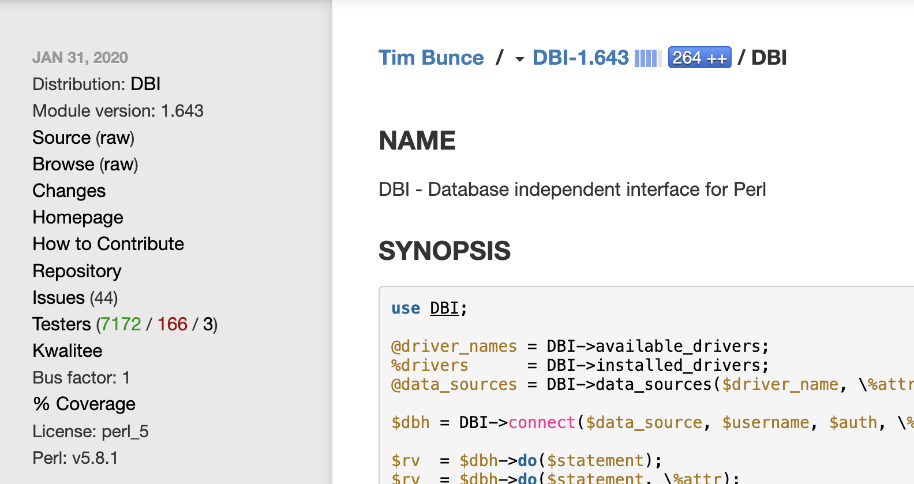

Note:
Some key parts of the Perl ecosystem are effectively being run by one or two people. What happens if the are no longer able to contribute?

---

#### https://xkcd.com/2347/

---

## CPAN Testers

Note:
* Doug Bell took this project over from Barbie.
* We have tried to get more volunteers to help Doug, but with no lasting success

---

## Devel::Cover / cpancover.com

Note:
* Paul Johnson
* If you use Coveralls or codecov.io, you probably use Devel::Cover

---

## PPI

Note:
* Christian Walde (mithaldu)
* I help a bit where I can, but this module is quite complex, many tools rely on it and it could use some help

---

## Futureproofing

* Publish to GitHub pages or some other public static site host
* Protect your domain name registration (see forthcoming slide)
* Consider moving to a GitHub Organization
* Assign co-maint to people you trust

Note:
If all you're doing with your app is using it for templating, then a static
site generator is much less complicated and much more portable.

---

## Recruit Help 💌

Don't be shy about asking for help with your project.

Note:
* If someone is contributing good code and doing it consistently, reach out to
see if they'd like to be more involved
* Most of the MetaCPAN core devs are involved because I asked them
* The MetaCPAN rewrite happened because I recruited a colleage from $work

---

## Beyond buses 🔒

Note:
What has been going on with security?

---

## CPAN Security Advisory Database

https://github.com/briandfoy/cpan-security-advisory

Note:
* There has been recent activity around identifying modules with existing CVEs.
* Hopefully this information will be integrated with the front end of MetaCPAN

---

## CPAN Security Working Group

* Established at the Perl Toolchain Summit in April 2023
* https://security.metacpan.org/

---

## prepan.org

Note:
* A place to discuss CPAN modules before your first upload
* Domain registration expired
* The repositories still exist in the MetaCPAN GitHub org
  * I have no idea where the data is
  * Nobody has expressed any desire to get this service back online

---

## Protecting Your Domain Names 🛡️

* Transfer ownership of your Perl-related domain to TPRF
* Domains will auto-renew at no cost to you
* The registration expiration failure mode is eliminated

---

## How to Transfer Your Domain Name ➡️

* Ask on TPRF Slack
  * https://join.slack.com/t/perlfoundation/shared_invite/zt-1yn4upl3r-mS6S2NljtC5dyqMgQCHZ1g
* Or just get in touch with me. My contact info is at https://metacpan.org/author/OALDERS

---

## Audience Participation 💯

---

## The Official Perl Logo Quiz

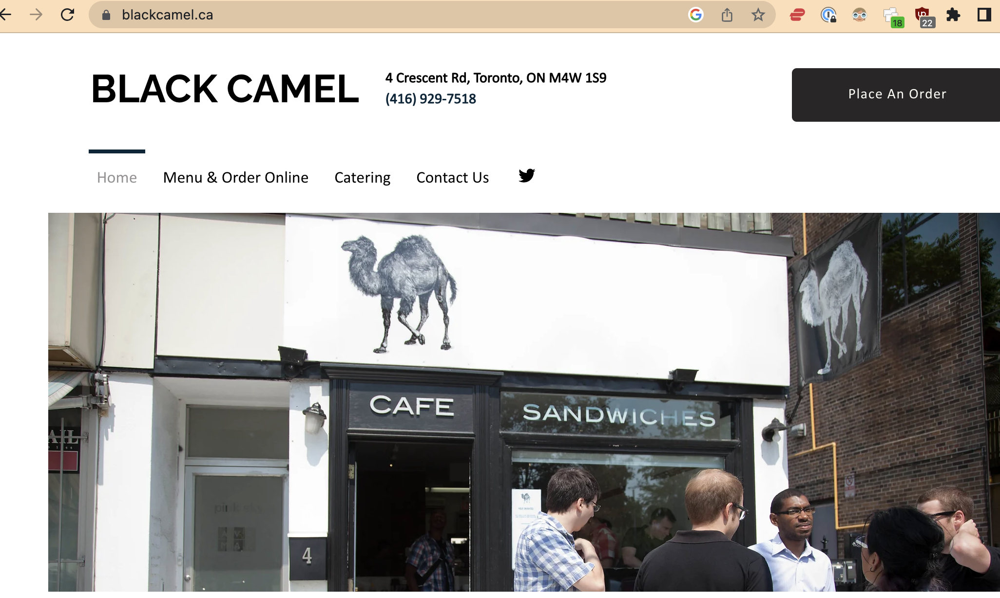

---

---

---

---

---

## Which is it?

* None of the above?
* All of the above?

---

## Do we already have a winner?

Note:
* The shadowed camel is already used in many places
* Mohammed was awarded neither a white onion nor a white velociraptor
* O'Reilly has expressed no discontent with its use
* There's even a camel emoji. How convenient!

---

## But we can't use it for books

Note:
* We could design a new logo, with buy-in from Perl communities
  * This would require identifying the various stakeholders so that we can
    establish who would make this decision
  * That would be hard
* The camel is there waiting for us. It's low-hanging fruit.

---

## How do we get new Perl developers?

---

## It's already happening and it has been for years

---

* New Perl developers are being created constantly

* New Perl programmers inherit legacy code which they have with they have to:
    * maintain
    * extend
    * rewrite
    * all of the above

---

## Are we giving new (and current) Perl developers great development tools?

* Focus on the editor experience
* Make the setup and execution of editing Perl on VSCode simple and easy
  * Try out Perl Navigator: https://marketplace.visualstudio.com/items?itemName=bscan.perlnavigator

Note:
  * Send pull requests (bscan is very responsive)
  * Let's focus efforts on one solution and make it even better
  * `vim` users can use Perl Navigator as a Language Server
  * Let's debug this in as many editors as possible

---

# Tree-sitter

> Tree-sitter is a parser generator tool and an incremental parsing library. It can build a concrete syntax tree for a source file and efficiently update the syntax tree as the source file is edited.

* https://github.com/tree-sitter-perl/tree-sitter-perl
  * Supports neovim and emacs

---

## Formatting

### `Perl::Tidy`

Note:
* We've got formatting solved. `Perl::Tidy` is an incredible tool and the developer is very responsive
* Best of all, we have one "go to" tool for tidying. No TIMTOWDI to work your way through

---

## Linting

* `Perl::Critic` as linting down to a science, 
  * but there are a lot of rules.
* `Perl Navigator` has a default critic profile: 
  * https://github.com/bscan/PerlNavigator/blob/main/server/src/perl/defaultCriticProfile

Note:
* This might be a good place to standardize on enforcing simple, understandable best practices for beginners

---

## Fixing

* See https://metacpan.org/dist/App-PerlNitpick
* Use https://metacpan.org/dist/App-perlimports where possible
  * This is an example of automated rewriting of your code
  * https://www.youtube.com/watch?v=fKqxdTbGxYY (Last year's conference talk)

Note:
* We can leverage `PPI` and `Perl::Critic` to fix some classes of linting errors

---

## precious

There is one excellent tool to harness all of your linters and tidiers.

* https://github.com/houseabsolute/precious

---

## Happy Developers = Happy Managers

* Making Perl a pleasant and easier language to work with can drive developer adoption (or retention)
* The more that Perl remains as a production languge, the better our chance of corporate donations

---

## Can We Do More with Less?

Note:
* We're like a business which is losing revenue. We need to find inefficiencies and redundancies to make the most out of our resources.
* Figure out which resources are worth saving and which could be archived
* Move more code and site ownership into GitHub organizations
* Switch to static site generators which can auto-deploy to GitHub pages (Jekyll/Hugo) rather than requiring people to jump through hoops to locally deploy and edit source code
* How many different JSON or YAML parsers does CPAN really need?

---

## Is Anyone in Charge?

We are a rudderless ship

Note:
* There is no dictator, benevolant or otherwise
* We're kind of bumbling along, sometimes in the same direction
* Who are some of the stakeholders?

---

## Stakeholders

  * TPRF
    * Fundraising
    * Grants
    * Marketing
    * Communication

---

## Stakeholders
  * PSC & P5P
    * Decisions about Perl the language

Note:
From an outsider's perspective (not on p5p) this part of the ecosystem seems to
be very functional. The journey to get to that place was very unfortunate.

---

## Stakeholders

  * The Perl Toolchain
    * Decisions about PAUSE, CPAN, testing and quality assurance modules

Note:
* Already meets in person once per year at the Perl toolchain summit
---

## Stakeholders

  * MetaCPAN
    * Part of the toolchain, but exists as a distinct organization
    * Has its own fundraising and infrastructure independent of other parts of the Perl ecosystem

Note:
* People who are new to Perl might well view it as the face of CPAN
* Meets once per year at the Perl Toolchain Summit

---

## Project Stakeholders

There are some very active projects whose voices should probably be heard when important decisions are made

* Mojolicious
* Catalyst
* Dancer
* DBIx::Class
* Perl Weekly
* Perl Weekly Challenge
* Authors of Perl books

---

## A meeting of the stakeholders?

Note:
* Perhaps representatives from some or all of these groups could meet quarterly for 90 minutes to discuss how they can help each other move forward?
* If we need to consider a new logo, getting buy-in from across the Perl communties is key.
* As I understand it, TPRF does consider themselves to have the mandate for a new logo and I think that's a correct assumption.

---

## TPRF Community Representatives

On a related note, TPRF does have an open door for people around the Perl world to make themselves heard.

* Meetings are on Friday per month at 17:30 UT
* Join TPRF Slack. Link expires in ~26 days:
  * https://join.slack.com/t/perlfoundation/shared_invite/zt-1yn4upl3r-mS6S2NljtC5dyqMgQCHZ1g

---

## Things That Are Helpful to Know

* https://perl.theplanetarium.org/
  * Has an RSS feed
  * Aggregates various Perl news sources
  * Improves upon http://ironman.enlightenedperl.org/ and https://blogs.perl.org/

---

## Helpful (continued)

CPAN authors, add yourself to the CPAN dashboard
* https://cpandashboard.com/
  * Quick overview of Kwalitee scores, build status and test coverage

---

## Helpful (Continuous Integration)

* Docker images with pre-installed Perl and pre-installed test and
development modules https://github.com/Perl/docker-perl-tester

---

## In Summary

* Shadowed camel
* Revive perl.com
* Focus on building an amazing Perl IDE experience
* Make it easier for new CPAN authors to thrive, especially new ones
