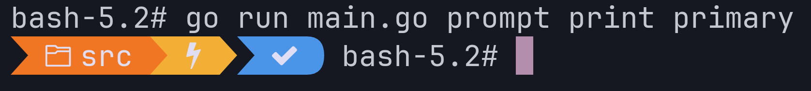

## Enough Docker to be Dangerous 🐳

Olaf Alders

Toronto(ish), July 2023

Note:

---

## What is Docker? 📚

Note:

* A tool for managing containers. This includes:
  * building containers
  * running containers
  * orchestrating containers
* Today we will be looking primarily at building and running containers.

---

## What is a container? 📦

Note:

* A Docker container image is a lightweight, standalone, executable package of
  software that includes everything needed to run an application: code,
  runtime, system tools, system libraries and settings
* Docker container images become containers at runtime

---

## A simple use case 🐪

```text
$ docker run --rm perl:5.38 perl --version

This is perl 5, version 38, subversion 0 (v5.38.0) built for aarch64-linux-gnu
```

This uses an official image from https://hub.docker.com/_/perl

Note:

* run
* --rm
  * Clean up when container exits. If you're not debugging your container,
    you'll generally want `--rm` in order to avoid filling your disk with the
    file systems of your old containers.
* perl:5.36

---

## Simple (continued) 🐫

If you get warnings about your platform, you can fix it up by specifying
a platform.

On my Mac:

```text
--platform=linux/x86_64
```

That gives us:

```text
docker run --rm --platform=linux/x86_64 perl:5.38 perl --version
```

Note:

* I started seeing these after moving to a newer Mac with Apple silicon (arm64).
* I'm going to leave this out for most of the follow examples for the sake of brevity.

---

## Running two commands 💥

```text
docker run --rm --platform=linux/x86_64 perl:5.38 \
  perl --version && perl --version
```

Note:

* What happened here?

---

## Running two commands ✅

```text
$ docker run --rm perl:5.38 \
  bash -c "perl --version && perl --version"
```

Note:

* This is a handy syntax if you want to do more complex things at the command line.

---

## Adding logic to your commands ➕

```text
docker run --rm perl:5.38 bash -c \
    "cpm install -g Crypt::XkcdPassword && \
    perl -MCrypt::XkcdPassword -E \
    'say Crypt::XkcdPassword->make_password'"
```

Note:

* run
* --rm
* -it
* perl:5.36

---

### Moving logic into a script 🚚

<!-- :read slides/8-intro-to-docker/app/pw.pl -->

```perl
#!/usr/bin/env perl

use 5.38.0;

use Crypt::XkcdPassword ();
use Term::ANSIColor     qw( color );

print color('bold blue');
say Crypt::XkcdPassword->make_password;
print color('reset');
```

---

### Running the script 👟

```text
docker run --rm                                    \
    -v "$PWD:/app"                                 \
    perl:5.38                                      \
    bash -c "cpm install -g Crypt::XkcdPassword && \
    ./app/pw.pl"
```

---

### Building your own images 🔨


`Dockerfile`:

 <!-- :read slides/8-intro-to-docker/app/Dockerfile  -->

```Dockerfile
FROM perl:5.38

RUN cpm install -g Crypt::XkcdPassword
```

 ---

```text
docker build -t xkcd-pw .
```
 ---

```text
docker run --rm -v "$PWD:/app" xkcd-pw ./app/pw.pl
```

---

### Running from inside a container 👋

```text
docker run --rm -it -v "$PWD:/app" xkcd-pw bash
```

---

### `docker run -it` 🏃‍♀️

* `-i`              : Keep STDIN open even if not attached
* `-t`              : Allocate a pseudo-tty

You will often see `-i -t` written as `-it`

Note:

* When you see `tty`, think `terminal`. That word has a lot of history that is interesting to research, but beyond the scope of what we're covering here.

---

### Building your own entrypoint images 🔨

`entrypoint-Dockerfile`

 ---

 <!-- :read slides/8-intro-to-docker/app/Dockerfile  -->

```Dockerfile
FROM perl:5.38

RUN cpm install -g Crypt::XkcdPassword

RUN mkdir app

COPY pw.pl /app/

ENTRYPOINT ["./app/pw.pl"]
```

 ---

```text
docker build -f entrypoint-Dockerfile -t pw .
```

---

### Easy incantation 🧙

```text
docker run pw
```

---

### Peeking inside an entrypoint container 🤔

```text
docker run --rm -it pw bash
```

---

### Overriding an ENTRYPOINT 💡

```text
docker run --rm -it --entrypoint bash pw
```

---

### Less is more 📈

 <!-- :read slides/8-intro-to-docker/app/Dockerfile  -->

```Dockerfile
FROM perl:5.38

RUN cpm install -g Crypt::XkcdPassword

RUN mkdir app

COPY pw.pl /app/

ENTRYPOINT ["./app/pw.pl"]
```

---

### Oops 😰

```
Multiple consecutive `RUN` instructions. Consider consolidation
```

```Dockerfile
FROM perl:5.38

RUN cpm install -g Crypt::XkcdPassword && mkdir app

COPY pw.pl /app/

ENTRYPOINT ["./app/pw.pl"]
```

---

### Peeking inside an arbitrary container 👀

```text
docker run --rm -it golang:latest bash
```

```text
root@870239ac7387:/go# go version
go version go1.19.5 linux/arm64

root@870239ac7387:/go# cat /etc/os-release
PRETTY_NAME="Debian GNU/Linux 11 (bullseye)"
NAME="Debian GNU/Linux"
VERSION_ID="11"
VERSION="11 (bullseye)"
VERSION_CODENAME=bullseye
ID=debian
HOME_URL="https://www.debian.org/"
SUPPORT_URL="https://www.debian.org/support"
BUG_REPORT_URL="https://bugs.debian.org/"
```

Note:

* `latest` is a special Docker tag. Generally it will "do the right thing"
* By default, you are `root` when you log in to a running Docker container

---

### Unzipping untrusted files 🤐

```text
docker run --rm -it -v $PWD:/app ruby:3.2.0-bullseye bash
```
 ---

```bash
mkdir /sandbox && cd /sandbox && unzip /app/untrusted.zip
```

Note:

* This may not prevent every exploit, but it can be a lot cleaner than opening
  thousands of files into a directory on your filesystem.

---

### Deploying an application 😅

```text
 docker run --rm -it     \
  -p 3000:3000           \
  -v $PWD:/sandbox       \
  ruby:3.2.0-bullseye bash 
```

* `-p` / `--publish`
* `-p $host:$container`

Note:

* -p is the `publish` flag

---

### List running containers 🏃📦

```text
$ docker ps
CONTAINER ID   IMAGE           COMMAND   CREATED         STATUS         PORTS     NAMES
66669b11657d   golang:latest   "bash"    5 seconds ago   Up 5 seconds             goofy_kepler
```

---

### Attach to a running container by id ➕

```text
$ docker exec -it 66669b11657d bash
root@66669b11657d:/go#
```

---

### Attach to a running container by name 📛

```text
$ docker exec -it goofy_kepler bash
root@66669b11657d:/go#
```

---

### Stop a running container by id 🛑 9️⃣

```text
docker stop 66669b11657d
```

---

### Stop a running container by name 🛑 📛

```text
docker stop goofy_kepler
```

---

### Use cases for Docker (testing) 🧪

* Testing behaviour under a specific OS
* Testing behaviour under specific software versions
* A combination of the above

---

### Use cases for Docker (isolation)

* Installing dependencies on the guest leaves the host untouched
* Untrusted code can be more easily sandboxed

---

### Use cases for Docker (tooling) 🧰

https://github.com/oalders/geoip2-csv2pg

* Download GeoIP2 CSV files and import them into a Pg database
  * You don't need `curl` installed locally
  * You don't need Linux running locally
  * You don't need Postgres installed locally

---

### Use cases for Docker (applications) 💼

`moov/watchman`

* Golang application, which refreshes its own data
* Immediate microservice, deployed locally

```text
$ docker run -p 8084:8084 -p 9094:9094 moov/watchman:latest
```

In another terminal:

```text
$ curl "localhost:8084/ofac/companies/13374"
```

---

### Advantages of Docker 🥳

* If well configured, you don't have to install many (or any) dependencies
* If filing a bug ticket, you can include a Docker incantation to reproduce the bug

---

#### Debugging an application 🐞

```text
$ gh repo clone houseabsolute/precious
$ cd precious

$ docker run -it --rm -v $PWD:/precious rust:slim-buster bash
root@053303aac27e:/# rustc --version
rustc 1.71.0 (8ede3aae2 2023-07-12)
root@053303aac27e:/# cd precious && cargo test
 ```

 Note:

 * Now you have a Rust development environment without having to configure it locally

---

#### Debugging Go + Bash 🐛

##### Creating a Dockerfile

```text
touch Dockerfile
```
 ---


```Dockerfile
FROM bash:5.2.15

# https://stackoverflow.com/a/59485924/406224
COPY --from=golang:1.20-alpine /usr/local/go/ /usr/local/go/

ENV PATH="/usr/local/go/bin:${PATH}"
```
 ---

```text
docker build -t bash-with-go .
```

Note:

* Multi-stage build
* Avoid multiple RUN statements

---

#### Run the image with the app mounted 🏃

```text
$ gh repo clone JanDeDobbeleer/oh-my-posh
$ cd oh-my-posh


$ docker run -it --rm -v $PWD:/oh-my-posh bash-with-go bash

bash-5.2# cd oh-my-posh/src/
bash-5.2# go test ./...
```

---

#### Test driving the prompt 🏎️



---

#### Docker: The Missing Bits 🔎

* `docker run -d | --detach`
* `docker compose`

---

#### Docker: The production deployment 🚀

* `docker swarm`
* just use k8s or k3s

---

#### In Summary 🏁

* Always `--rm` unless debugging a container after shutdown
* Use `bash -c` if doing something requiring more than one statement
* Use Docker to avoid having to install a lot of dependencies
* Use `docker build` to allow others to replicate your issues
